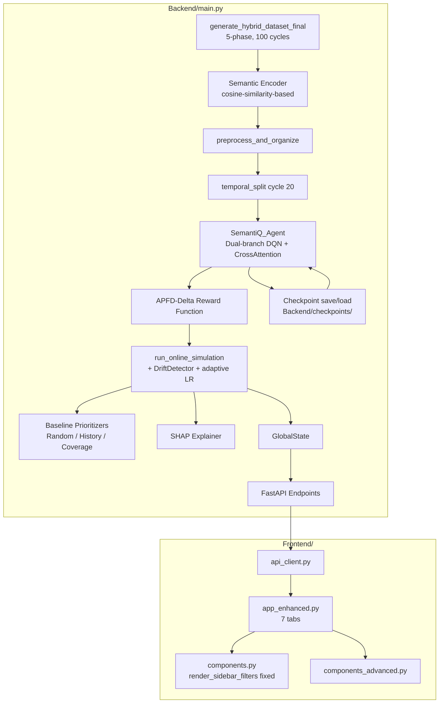
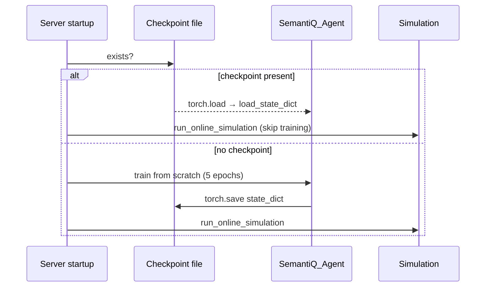

# Design Document: Semanti-Q Improvements

## Overview

This document describes the technical design for ten targeted improvements to the Semanti-Q test prioritization system. The changes span the data generation pipeline, the RL reward function, baseline comparisons, model persistence, neural architecture, drift-aware learning, SHAP explainability, and the Streamlit frontend. Together they close the gap between the current prototype and a scientifically reproducible system suitable for an IEEE paper.

All changes are confined to three files:
- `Backend/main.py` — FastAPI server, PyTorch model, simulation logic
- `Frontend/app_enhanced.py` — Streamlit application
- `Frontend/components.py` — Shared UI components (sidebar filter fix)

No new files are introduced except the checkpoint directory `Backend/checkpoints/`.

---

## Architecture



The startup sequence branches on checkpoint existence:



---

## Components and Interfaces

### 1. `generate_hybrid_dataset_final` (revised)

Replaces the current two-phase (Backend/Frontend) generator with a deterministic five-phase version.

**Phase mapping** (100 cycles total):

| Phase    | Cycles  | commit_focus dims | Spike dims |
|----------|---------|-------------------|------------|
| Backend  | 0–19    | 0–1               | 0, 1       |
| Frontend | 20–39   | 2–3               | 2, 3       |
| Database | 40–59   | 4–5               | 4, 5       |
| API      | 60–79   | 6–7               | 6, 7       |
| Mobile   | 80–99   | 8–9               | 8, 9       |

`commit_focus` is chosen deterministically as `phase_start_dim + (cycle % 2)` so the spike dimension is stable within a phase.

**Validation**: after building the DataFrame, the function checks `set(df['drift_phase'].unique()) == {"Backend","Frontend","Database","API","Mobile"}` and raises `ValueError` if not.

### 2. Context-Aware Semantic Encoder

Replaces the current `semantic_vector = np.random.normal(0, 0.05, 10) + spike` with a deterministic, test-specific construction:

```
base = sensitivity_vector * dot(sensitivity_vector, commit_focus_vector)
noise = np.random.normal(0, 0.05, 10)
raw = base + noise
semantic_vector = raw / ||raw||   # L2 normalize
```

Where `commit_focus_vector` is a one-hot-like vector with 1.2 at the active `commit_focus` dimension. This ensures tests whose `focus_area` aligns with the active drift phase get high cosine similarity to each other, while tests in different areas get low similarity.

### 3. APFD-Delta Reward Function

Replaces the current priority-lookup reward with a proper APFD-delta signal.

For each cycle, after the agent assigns execution order:
1. Compute `apfd_agent` = APFD of the agent's ordering.
2. Compute `apfd_random` = APFD of a uniform random ordering (expected ≈ 0.5).
3. For each test at position `k`:
   - If `test_result == 0` (failing): `reward = (apfd_agent - apfd_random) * position_weight(k, n)`
   - If `test_result == 1` (passing): `reward = 0.0`
4. Clip all rewards to `[-1.0, 1.0]`.

`position_weight(k, n) = 2 * (n - k + 1) / (n * (n + 1))` — a normalized rank weight that distributes the APFD delta across failing tests proportionally to their position benefit.

### 4. Baseline Prioritizers

Three standalone functions, each taking a cycle DataFrame and returning it sorted:

```python
def random_baseline(df, seed=42) -> pd.DataFrame
def history_baseline(df) -> pd.DataFrame      # sort by fail_count_rolling desc
def coverage_baseline(df) -> pd.DataFrame     # sort by complexity_score * code_churn desc
```

Results are computed during `run_online_simulation` and stored in `GlobalState.baseline_apfd_history` as a dict with keys `"random"`, `"history_based"`, `"coverage_based"`, `"semanti_q"`.

### 5. APFD Calculation Fix

The existing `calculate_apfd` is correct in formula but `execution_order` must be assigned as `range(1, n+1)` (1-indexed, no gaps). The fix is in `run_online_simulation` where `prioritized_data['execution_order'] = range(1, len(prioritized_data) + 1)` replaces any existing assignment.

Edge case: if `m == 0` (no failures), return `1.0`.

### 6. Checkpoint Persistence

New directory: `Backend/checkpoints/`  
Checkpoint path: `Backend/checkpoints/semanti_q_agent.pt`

Startup logic in `run_simulation_background`:

```python
CHECKPOINT_PATH = "Backend/checkpoints/semanti_q_agent.pt"
os.makedirs("Backend/checkpoints", exist_ok=True)

if os.path.exists(CHECKPOINT_PATH):
    agent.load_state_dict(torch.load(CHECKPOINT_PATH, map_location=device))
    # skip training, go straight to online simulation
else:
    # run training loop
    torch.save(agent.state_dict(), CHECKPOINT_PATH)
```

`GlobalState` gains `checkpoint_saved_at: Optional[datetime]` and `checkpoint_size_bytes: int`.

New endpoint: `GET /api/model/checkpoint-status` returns `{exists, size_bytes, saved_at}`.

### 7. Cross-Attention Fusion Layer

Replaces `torch.cat((x1, x2), dim=1)` + linear with scaled dot-product cross-attention.

The semantic branch output (`x2`, shape `[B, 32]`) acts as **query Q**.  
The statistical branch output (`x1`, shape `[B, 32]`) acts as **key K** and **value V**.

```
d_k = 32
scores = (Q @ K^T) / sqrt(d_k)          # [B, 1] when Q,K are [B,32] treated as single-head
attn_weights = softmax(scores, dim=-1)   # sums to 1.0 per sample
attended = attn_weights * V              # [B, 32]
```

For single-vector (non-sequence) inputs, this simplifies to:

```python
class CrossAttentionFusion(nn.Module):
    def __init__(self, dim=32):
        super().__init__()
        self.scale = dim ** 0.5
        self.out = nn.Linear(dim, 1)

    def forward(self, stat_feat, sem_feat):
        # stat_feat, sem_feat: [B, dim]
        score = (sem_feat * stat_feat).sum(dim=-1, keepdim=True) / self.scale  # [B, 1]
        attn = torch.sigmoid(score)   # scalar gate per sample
        fused = attn * stat_feat + (1 - attn) * sem_feat                       # [B, dim]
        return self.out(fused), attn  # output score + weights for explainability
```

`GlobalState` gains `last_attention_weights: Optional[np.ndarray]` updated on each inference batch.

New endpoint: `GET /api/ai/attention-weights` returns the stored weights as a list.

### 8. Drift-Aware Adaptive Learning Rate

A `DriftDetector` class monitors the rolling mean of `test_result` over a 10-cycle window:

```python
class DriftDetector:
    def __init__(self, window=10, threshold=0.05):
        self.window = window
        self.threshold = threshold
        self.history = deque(maxlen=window)
        self.prev_mean = None

    def update(self, cycle_pass_rate: float) -> bool:
        self.history.append(cycle_pass_rate)
        if len(self.history) < self.window:
            return False
        current_mean = np.mean(self.history)
        if self.prev_mean is None:
            self.prev_mean = current_mean
            return False
        drift = abs(current_mean - self.prev_mean) > self.threshold
        self.prev_mean = current_mean
        return drift
```

In `run_online_simulation`, after each cycle:
- Call `detector.update(cycle_pass_rate)`.
- If drift detected: `lr = min(lr * 2.0, 0.01)`, reset `cycles_since_drift = 0`, log event.
- If no drift and `cycles_since_drift >= 5`: `lr = max(lr * 0.9, BASE_LR)`.
- Apply `lr` to optimizer param groups.

`GlobalState` gains `drift_history: List[Dict]` storing `{cycle_id, old_lr, new_lr, rolling_mean_before, rolling_mean_after}`.

New endpoint: `GET /api/model/drift-history` returns the list.

### 9. SHAP Explainability

Uses `shap.DeepExplainer` (or `shap.GradientExplainer` as fallback) on the `SemantiQ_Agent`.

After each online simulation cycle, SHAP values are computed for the statistical feature branch inputs of that cycle's batch. Results are cached in `GlobalState.shap_cache: Dict[int, Dict]` keyed by `cycle_id`.

```python
# After inference for a cycle:
background = torch.FloatTensor(background_data).to(device)
explainer = shap.DeepExplainer(ShapWrapper(agent), background)
shap_values = explainer.shap_values(stats_tensor)
```

`ShapWrapper` is a thin `nn.Module` that accepts only the stats tensor (fixes the two-input signature for SHAP).

Top-5 features by mean absolute SHAP value are stored per cycle.

New endpoint: `GET /api/ai/shap-summary` returns `{cycle_id, top_features: [{name, mean_abs_shap}]}`.

Minimum batch size guard: if `len(batch) < 10`, return HTTP 422 with descriptive message.

### 10. Frontend Enhancements

#### `render_sidebar_filters` fix (`Frontend/components.py`)

Remove the `session_state.filters.get(...)` calls. Replace with explicit default parameters:

```python
def render_sidebar_filters(
    api_client,
    default_start_date=None,
    default_end_date=None,
    default_drift_phases=None
) -> Optional[Dict]:
```

`app_enhanced.py` already uses `render_sidebar_enhanced()` (its own inline function) and does not call `render_sidebar_filters`, so the fix prevents `AttributeError` if any other caller uses the shared component.

#### New "📊 Baselines" tab

Added as tab 6 in `app_enhanced.py`. Calls `api_client.get_baselines_apfd()` and renders a Plotly line chart with four series (Random, History-Based, Coverage-Based, Semanti-Q) over cycles 20–99.

New `APIClient` method: `get_baselines_apfd() -> Dict`.

#### New "🔍 Explainability" tab

Added as tab 7 in `app_enhanced.py`. Two sub-sections:
1. SHAP bar chart — top-5 features by mean |SHAP|, sourced from `/api/ai/shap-summary`.
2. Attention weight heatmap — per-sample attention gate values from `/api/ai/attention-weights`, rendered as a Plotly heatmap.

New `APIClient` methods: `get_shap_summary() -> Dict`, `get_attention_weights() -> Dict`.

---

## Data Models

### GlobalState additions

```python
class GlobalState:
    # existing fields ...
    baseline_apfd_history: Dict[str, List[float]]  # keys: random, history_based, coverage_based, semanti_q
    drift_history: List[Dict]                       # [{cycle_id, old_lr, new_lr, ...}]
    last_attention_weights: Optional[np.ndarray]    # shape [batch_size, 1]
    shap_cache: Dict[int, Dict]                     # cycle_id -> {top_features, raw_values}
    checkpoint_saved_at: Optional[datetime]
    checkpoint_size_bytes: int
```

### New API response shapes

```python
# GET /api/baselines/apfd
{
  "random": [0.51, 0.49, ...],          # 80 values (cycles 20-99)
  "history_based": [0.62, 0.65, ...],
  "coverage_based": [0.58, 0.61, ...],
  "semanti_q": [0.71, 0.74, ...]
}

# GET /api/model/checkpoint-status
{
  "exists": true,
  "size_bytes": 245760,
  "saved_at": "2024-01-15T10:30:00"
}

# GET /api/model/drift-history
[
  {"cycle_id": 25, "old_lr": 0.001, "new_lr": 0.002,
   "rolling_mean_before": 0.94, "rolling_mean_after": 0.88}
]

# GET /api/ai/attention-weights
{
  "weights": [0.62, 0.71, ...],   # one value per test in last batch
  "cycle_id": 99
}

# GET /api/ai/shap-summary
{
  "cycle_id": 99,
  "top_features": [
    {"name": "fail_count_rolling", "mean_abs_shap": 0.34},
    {"name": "code_churn",         "mean_abs_shap": 0.21},
    ...
  ]
}
```

### Semantic vector schema

Each record's `semantic_vector` is a Python list of 10 floats, L2-normalized to unit length. Stored as-is in the DataFrame (object column containing lists), consistent with the existing `np.stack(...)` usage in tensor construction.

---

## Correctness Properties


*A property is a characteristic or behavior that should hold true across all valid executions of a system — essentially, a formal statement about what the system should do. Properties serve as the bridge between human-readable specifications and machine-verifiable correctness guarantees.*

### Property 1: Five-phase drift coverage invariant

*For any* call to `generate_hybrid_dataset_final`, the set of unique `drift_phase` values in the returned DataFrame shall equal exactly `{"Backend", "Frontend", "Database", "API", "Mobile"}`.

**Validates: Requirements 1.1, 1.5**

---

### Property 2: Cycle-to-phase assignment invariant

*For any* row in a generated dataset, the `drift_phase` value shall equal the phase determined by the formula `PHASES[cycle_id // 20]` where `PHASES = ["Backend","Frontend","Database","API","Mobile"]`.

**Validates: Requirements 1.2**

---

### Property 3: Semantic spike alignment

*For any* record in the generated dataset, `argmax(semantic_vector)` shall fall within the two-dimensional range assigned to that record's `drift_phase` (Backend→[0,1], Frontend→[2,3], Database→[4,5], API→[6,7], Mobile→[8,9]).

**Validates: Requirements 1.3, 1.4**

---

### Property 4: Semantic vector normalization invariant

*For any* semantic vector produced by the encoder, its L2 norm shall equal 1.0 within a tolerance of 1e-5.

**Validates: Requirements 2.4, 2.5**

---

### Property 5: Same-phase cosine similarity

*For any* two tests with the same `focus_area` executed in the same drift phase, the cosine similarity of their semantic vectors shall be at least 0.7.

**Validates: Requirements 2.2**

---

### Property 6: Different-phase cosine dissimilarity

*For any* two tests whose `focus_area` dimensions differ by at least 3, the cosine similarity of their semantic vectors shall be at most 0.3.

**Validates: Requirements 2.3**

---

### Property 7: Reward sign correctness

*For any* cycle ordering: (a) a failing test placed in the top 10% of execution order shall receive a reward > 0; (b) a passing test in any position shall receive a reward in [-0.1, 0.0]; (c) a failing test placed in the bottom 50% shall receive a reward < 0.

**Validates: Requirements 3.2, 3.3, 3.4**

---

### Property 8: Reward clipping invariant

*For any* computed reward value, the clipped result shall lie within [-1.0, 1.0].

**Validates: Requirements 3.5**

---

### Property 9: Reward additivity

*For any* cycle, the sum of all per-test APFD-delta rewards shall equal `APFD(agent_ordering) - APFD(random_ordering)` within a tolerance of 1e-4.

**Validates: Requirements 3.6**

---

### Property 10: Random baseline reproducibility

*For any* cycle DataFrame, calling `random_baseline(df, seed=42)` twice shall produce identical orderings.

**Validates: Requirements 4.1**

---

### Property 11: History baseline ordering invariant

*For any* cycle DataFrame, the output of `history_baseline` shall be sorted in strictly non-increasing order of `fail_count_rolling`.

**Validates: Requirements 4.2**

---

### Property 12: Coverage baseline ordering invariant

*For any* cycle DataFrame, the output of `coverage_baseline` shall be sorted in strictly non-increasing order of `complexity_score * code_churn`.

**Validates: Requirements 4.3**

---

### Property 13: History baseline outperforms random

*For any* dataset generated by `generate_hybrid_dataset_final`, the mean APFD of the history-based baseline over cycles 20–99 shall be greater than the mean APFD of the random baseline over the same cycles.

**Validates: Requirements 4.7**

---

### Property 14: Execution order is a valid permutation

*For any* prioritized cycle DataFrame of size n, the `execution_order` column shall be a permutation of the integers [1, 2, …, n] with no gaps or duplicates.

**Validates: Requirements 5.1**

---

### Property 15: APFD range invariant

*For any* valid test ordering of any cycle, `calculate_apfd` shall return a value in [0.0, 1.0].

**Validates: Requirements 5.5**

---

### Property 16: Checkpoint round-trip

*For any* input tensor pair `(stats, sem)`, the model output before `torch.save` shall equal the model output after `torch.load` + `load_state_dict` within floating-point tolerance 1e-6.

**Validates: Requirements 6.4**

---

### Property 17: Attention weight softmax invariant

*For any* batch of inputs to the `CrossAttentionFusion` module, the attention gate values shall lie in (0, 1) (sigmoid output), and the weighted combination `attn * stat + (1-attn) * sem` shall be a valid convex combination per sample.

**Validates: Requirements 7.2, 7.4**

---

### Property 18: Attention output shape invariant

*For any* batch of size B, the output of `CrossAttentionFusion.forward` shall have shape `(B, 1)` for the score and `(B, 1)` for the attention weights.

**Validates: Requirements 7.3**

---

### Property 19: Drift detection threshold property

*For any* sequence of per-cycle pass rates where the absolute change in the 10-cycle rolling mean exceeds 0.05, `DriftDetector.update` shall return `True`.

**Validates: Requirements 8.1**

---

### Property 20: Learning rate bounds after drift

*For any* current learning rate `lr` when drift is detected, the new learning rate shall equal `min(lr * 2.0, 0.01)`.

**Validates: Requirements 8.2**

---

### Property 21: Learning rate decay after stability

*For any* learning rate `lr` after 5 consecutive stable cycles, the learning rate shall be updated to `max(lr * 0.9, 0.001)` per cycle.

**Validates: Requirements 8.3**

---

### Property 22: SHAP additivity

*For any* test input `x` in an inference batch of size ≥ 10, the sum of SHAP values across all features shall equal `model(x) - E[model(background)]` within a tolerance of 1e-3.

**Validates: Requirements 9.2**

---

### Property 23: SHAP cache idempotence

*For any* cycle ID for which SHAP values have already been computed, calling the SHAP computation again without new simulation data shall return the cached result unchanged.

**Validates: Requirements 9.5**

---

### Property 24: Filter parameter propagation

*For any* selection of drift phases in the sidebar, clicking "Apply Filters" shall result in an API call whose `drift_phase` query parameter exactly matches the selected phases.

**Validates: Requirements 10.5**

---

## Error Handling

| Scenario | Handling |
|---|---|
| `generate_hybrid_dataset_final` produces fewer than 5 drift phases | Raise `ValueError("Dataset missing drift phases: {missing}")` |
| Checkpoint file is corrupt / incompatible | Catch `RuntimeError` from `torch.load`, log warning, fall back to full retraining |
| SHAP batch size < 10 | Return HTTP 422 `{"detail": "Batch too small for SHAP: need >= 10 samples, got {n}"}` |
| Backend unreachable from frontend | `api_client._make_request` catches `requests.exceptions.RequestException`, returns `None`; all callers check for `None` and display `st.error` with retry button |
| Drift detector called before window is full | Return `False` (no drift signal) until `len(history) >= window` |
| Attention weights not yet computed (no inference run) | `/api/ai/attention-weights` returns `{"weights": [], "cycle_id": null}` |
| SHAP cache miss for requested cycle | Recompute on demand; if agent not trained yet, return HTTP 503 |
| Zero-failure cycle in APFD calculation | Return `1.0` immediately without division |

---

## Testing Strategy

### Dual Testing Approach

Both unit tests and property-based tests are required. Unit tests cover specific examples, boundary conditions, and API contracts. Property-based tests verify universal invariants across randomly generated inputs.

### Property-Based Testing

**Library**: `hypothesis` (Python) with `hypothesis.strategies` for generating test inputs.

Each property test runs a minimum of **100 iterations** (`@settings(max_examples=100)`).

Each test is tagged with a comment in the format:
`# Feature: semanti-q-improvements, Property {N}: {property_text}`

**Property test mapping:**

| Property | Test function | Key generators |
|---|---|---|
| P1: Five-phase coverage | `test_five_phase_coverage` | `st.integers(min_value=100, max_value=600)` for n_tests |
| P2: Cycle-to-phase assignment | `test_cycle_phase_assignment` | rows sampled from generated dataset |
| P3: Semantic spike alignment | `test_semantic_spike_alignment` | rows sampled from generated dataset |
| P4: Normalization invariant | `test_semantic_normalization` | rows sampled from generated dataset |
| P5: Same-phase cosine similarity | `test_same_phase_cosine_sim` | pairs of tests with same focus_area and drift_phase |
| P6: Different-phase dissimilarity | `test_different_phase_cosine_sim` | pairs of tests with focus_area distance >= 3 |
| P7: Reward sign correctness | `test_reward_sign` | random cycle orderings with known fail positions |
| P8: Reward clipping | `test_reward_clipping` | `st.floats(min_value=-100, max_value=100)` |
| P9: Reward additivity | `test_reward_additivity` | random cycle DataFrames |
| P10: Random baseline reproducibility | `test_random_baseline_reproducible` | random cycle DataFrames |
| P11: History baseline ordering | `test_history_baseline_ordering` | random cycle DataFrames |
| P12: Coverage baseline ordering | `test_coverage_baseline_ordering` | random cycle DataFrames |
| P13: History > random APFD | `test_history_beats_random` | full generated dataset |
| P14: Execution order permutation | `test_execution_order_permutation` | random cycle DataFrames |
| P15: APFD range | `test_apfd_range` | random orderings with random fail positions |
| P16: Checkpoint round-trip | `test_checkpoint_roundtrip` | random float tensors of correct shape |
| P17: Attention softmax invariant | `test_attention_weights_valid` | random batches of size 1–64 |
| P18: Attention output shape | `test_attention_output_shape` | `st.integers(min_value=1, max_value=64)` for batch size |
| P19: Drift detection threshold | `test_drift_detector_threshold` | sequences of pass rates with known delta |
| P20: LR bounds after drift | `test_lr_after_drift` | `st.floats(min_value=1e-5, max_value=0.01)` for lr |
| P21: LR decay after stability | `test_lr_decay_stability` | `st.floats(min_value=0.001, max_value=0.01)` for lr |
| P22: SHAP additivity | `test_shap_additivity` | random batches of size >= 10 |
| P23: SHAP cache idempotence | `test_shap_cache_idempotence` | fixed cycle_id, called twice |
| P24: Filter propagation | `test_filter_parameter_propagation` | random subsets of the 5 drift phases |

### Unit Tests

Unit tests focus on specific examples, boundary conditions, and API contracts. Avoid duplicating what property tests already cover.

**Key unit tests:**

- `test_data_generator_raises_on_missing_phases` — mock generator to produce 4 phases, assert `ValueError` (Req 1.5)
- `test_apfd_all_failures_first` — construct ordering with all failures at positions 1..m, assert APFD ≥ 1 - m/(2n) (Req 5.2)
- `test_apfd_all_failures_last` — assert APFD ≤ 1/(2n) (Req 5.3)
- `test_apfd_zero_failures` — assert APFD == 1.0 (Req 5.4)
- `test_checkpoint_file_created` — run training, assert file exists at expected path (Req 6.1)
- `test_checkpoint_status_endpoint` — call `/api/model/checkpoint-status`, assert response schema (Req 6.5)
- `test_baselines_apfd_endpoint` — call `/api/baselines/apfd`, assert 4 keys each with 80 values (Req 4.5)
- `test_random_baseline_mean_apfd_range` — assert mean in [0.45, 0.60] (Req 4.6)
- `test_shap_small_batch_error` — call SHAP with 5 samples, assert HTTP 422 (Req 9.4)
- `test_shap_summary_endpoint` — call `/api/ai/shap-summary`, assert top_features has 5 entries (Req 9.3)
- `test_attention_weights_endpoint` — call `/api/ai/attention-weights`, assert response schema (Req 7.5)
- `test_drift_history_endpoint` — call `/api/model/drift-history`, assert list of dicts with required keys (Req 8.5)
- `test_sidebar_filters_no_session_state` — call `render_sidebar_filters` without `session_state.filters`, assert no `AttributeError` (Req 10.6)
- `test_dashboard_startup_no_errors` — import `app_enhanced`, assert no `ImportError` or `AttributeError` (Req 10.1)
- `test_baselines_tab_present` — assert "Baselines" tab is created in `main()` (Req 10.7)
- `test_explainability_tab_present` — assert "Explainability" tab is created in `main()` (Req 10.8)
